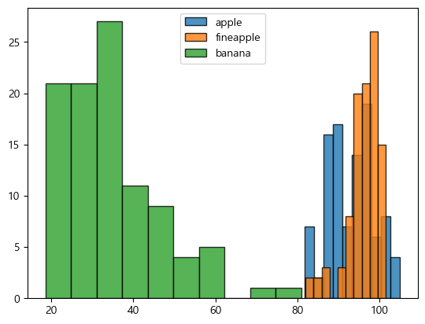
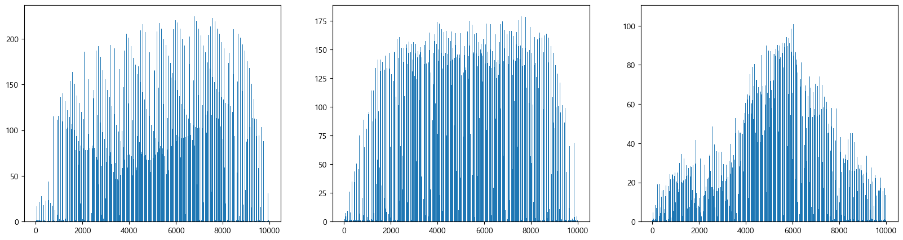
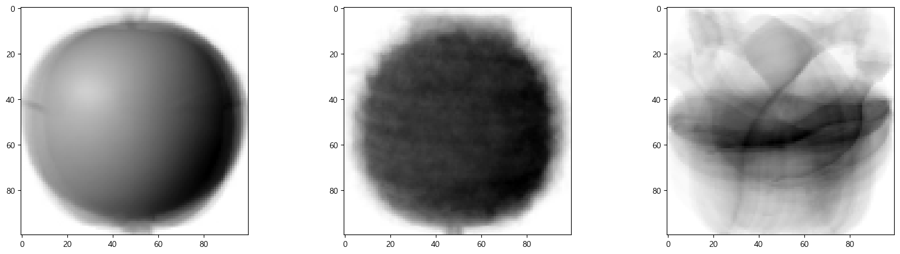
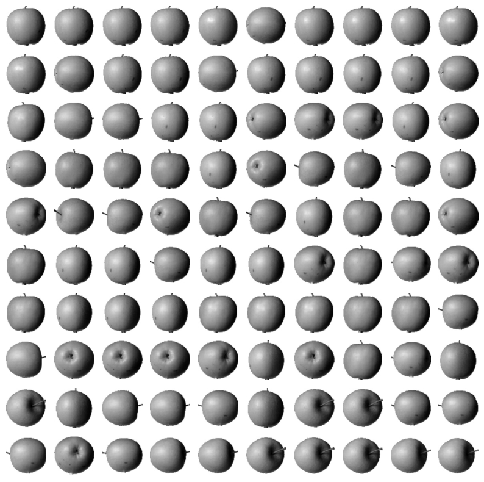

= Lab 8-3 이미지 군집

이 연습에서는 Numpy 배열로 전달된 이미지 정보를 사용하여 사과, 파인애플, 바나나에 대한 데이터 군집을 생성합니다. 아래 절차에 따릅니다.

== 실습 환경 준비

여기에서는 Visual Studio Code의 Jupyter Notebook을 사용하여 연습을 수행합니다. 이 연습의 수행 환경은 Lab 1-1에서와 같습니다.

. Visual Studio Code를 실행합니다.
. 파일 메뉴에서 폴더 열기 를 클릭합니다.
. 연습을 수행할 폴더를 선택하고 확인 버튼을 클릭합니다.
. Visual Studio Code의 Explorer 에서 New Button을 클릭하여 새 파일을 만들고, 이름을 lab8-2.ipynb로 지정합니다.
. 오른쪽 위의 Select Kernel 을 클릭하고 Anaconda Python 환경을 선택합니다.
. + Code 버튼을 클릭하여 노트북을 시작합니다.

== 라이브러리 import

이 연습에셔는 numpy과 matplotlit 라이브러리를 사용합니다. 아래 절차에 따라 연습에 필요한 라이브러리를 import 합니다.

1. 생성한 Code 노트에 아래 코드를 입력합니다.
+
[source, python]
----
import numpy as np
import matplotlib.pyplot as plt
----

2. Shift + Enter 를 클릭하여 작성한 코드를 실행합니다.

== 파일 로드 및 확인

여기에서는 .npy 형식으로 저장된 이미지 데이터를 읽어들입니다. 다음 절차에 따릅니다.

1. 아래 링크에서 fruits_300.npy 파일을 다운로드하여 lab8-2.ipynb 파일이 위치한 폴더로 복사합니다.
+
https://github.com/gikpreet/class-machine_learning/blob/main/Module%2008%20Unsupervised%20Learning/data/npy/fruits_300.npy

2. 아래와 유사한 코드를 실행하여 npy 파일을 로드합니다.
+
[source, python]
----
fruits = np.load('./fruits_300.npy')
----
+
3. 아래 코드를 실행하여 로드한 데이터의 타입과 형식을 확인합니다.
+
[source, python]
----
print(type(fruits))
print(fruits.shape)
----
+
----
<class 'numpy.ndarray'>
(300, 100, 100)
----

== 이미지 데이터를 1차원 배열로 만들어 분류

fruits 배열에는 사과, 파인애플, 바나나가 100개씩 순서대로 포함되어 있습니다. 여기에서는 데이터를 이미지별로 구분하여 각 과일별 배열을 만듭니다. 

각 과일의 배열은 2차원 배열 형태입니다. 2차원 배열은 계산이 복잡하고 리소스를 많이 소요하므로 각 과일을 표시하는 2차원 배열을 1차원 배열로 만들어 분류합니다.

아래 절차에 따릅니다.

1. 아래 코드를 실행하여 사과, 파인애플, 바나나 배열을 만들고 데이터를 분할하여 로드합니다.
+
[source, python]
----
apple = fruits[0:100].reshape(-1, 100 * 100)
pineapple = fruits[100:200].reshape(-1, 100 * 100)
banana = fruits[200:300].reshape(-1, 100 * 100)
----
+
2. 아래 코드를 실행하여 배열의 모양을 확인합니다.
+
[source, python]
----
print(apple.shape)
print(pineapple.shape)
print(banana.shape)
----

== 이미지의 평균값 계산

이 연습에서는 이미지의 샘플 평균과 픽셀 평균을 계산하고 비교합니다.

=== 샘플 평균

샘플 평균은 여러 장의 이미지가 있는 경우, 각 이미지의 평균 값(즉, 한 이미지의 모든 픽셀 값의 평균)을 구한 후, 이러한 평균을 다시 평균화한 값입니다. 여기에서는 각 이미지(배열에 포함된 각 1차원 배열)의 평균을 구합니다. 아래 절차에 따릅니다.

1. 아래 코드를 실행하여 각 과일의 모든 샘플의 평균을 구합니다.
+
[source, python]
----
apple_sample_mean = apple.mean(axis=1)
pineapple_sample_mean = pineapple.mean(axis=1)
banana_sample_mean = banana.mean(axis=1)
----
+
2. 아래 코드를 실행하여 사과의 샘플 평균값을 확인합니다.
+
[source, python]
----
print(apple_sample_mean)
----
+
----
[ 88.3346  97.9249  87.3709  98.3703  92.8705  82.6439  94.4244  95.5999
  90.681   81.6226  87.0578  95.0745  93.8416  87.017   97.5078  87.2019
  88.9827 100.9158  92.7823 100.9184 104.9854  88.674   99.5643  97.2495
  94.1179  92.1935  95.1671  93.3322 102.8967  94.6695  90.5285  89.0744
  97.7641  97.2938 100.7564  90.5236 100.2542  85.8452  96.4615  97.1492
  90.711  102.3193  87.1629  89.8751  86.7327  86.3991  95.2865  89.1709
  96.8163  91.6604  96.1065  99.6829  94.9718  87.4812  89.2596  89.5268
  93.799   97.3983  87.151   97.825  103.22    94.4239  83.6657  83.5159
 102.8453  87.0379  91.2742 100.4848  93.8388  90.8568  97.4616  97.5022
  82.446   87.1789  96.9206  90.3135  90.565   97.6538  98.0919  93.6252
  87.3867  84.7073  89.1135  86.7646  88.7301  86.643   96.7323  97.2604
  81.9424  87.1687  97.2066  83.4712  95.9781  91.8096  98.4086 100.7823
 101.556  100.7027  91.6098  88.8976]
----
+
3. 아래 코드를 실행하여 히스토그램을 그리고 샘플 평균 값의 분포를 확인합니다.
+
[source, python]
----
plt.hist(apple_sample_mean, alpha=0.8, edgecolor='black')
plt.hist(pineapple_sample_mean, alpha=0.8, edgecolor='black')
plt.hist(banana_sample_mean, alpha=0.8, edgecolor='black')
plt.legend(['apple','fineapple','banana'])
plt.show()
----
+

히스토그램 상에서는 바나나 사진은 구분되지만 사과와 파인애플은 90~100사이에 집중되어 샘플 평균 값으로는 구분이 쉽지 않다는 것이 확인됩니다.

=== 픽셀 평균

픽셀 평균은 여러 장의 이미지가 있을 때, 모든 이미지를 하나로 합쳐 모든 픽셀 값의 평균을 계산하는 방식입니다. 이는 모든 이미지의 픽셀 값을 단일 데이터로 취급하여 평균을 구합니다. 여기에서는 모든 이미지의 값을 하나로 합친 픽셀값에 대한 평균을 구합니다. 아래 절차에 따릅니다.

1. 아래 코드를 실행하여 각 과일의 pixel 평균을 구합니다.
+
[source, python]
----
apple_pixel_mean = apple.mean(axis=0)
pineapple_pixel_mean = pineapple.mean(axis=0)
banana_pixel_mean = banana.mean(axis=0)
----
+
2. 아래 코드를 실행하여 각 pixel 평균의 그래프를 그려 평균값을 확인합니다.
+
[source, python]
----
fig, axs = plt.subplots(1, 3, figsize=(20, 5))
axs[0].bar(range(10000), apple_pixel_mean)
axs[1].bar(range(10000), pineapple_pixel_mean)
axs[2].bar(range(10000), banana_pixel_mean)
plt.show()
----
+

각 그래프를 확인하면 과일마다 값이 높은 구간이 다름을 확인할 수 있습니다.

== 과일별 대표 이미지

만들어진 픽셀 평균값을 100 * 100 배열로 변경하여 픽셀 평균별 대표 이미지를 작성해 볼 수 있습니다. 아래 절차에 따릅니다.

1. 아래 코드를 실행하여 각 과일 픽셀 평균 배열을 100 * 100으로 변환합니다.
+
[source, python]
----
apple_mean = apple_pixel_mean.reshape(100, 100)
pineapple_mean = pineapple_pixel_mean.reshape(100, 100)
banana_mean = banana_pixel_mean.reshape(100, 100)
----
+
2. 아래 코드를 실행하여 각 과일의 픽셀 평균을 이용하여 이미지화 합니다.
+
[source, python]
----
fig, axs = plt.subplots(1, 3, figsize=(20,5))
axs[0].imshow(apple_mean, cmap='gray_r')
axs[1].imshow(pineapple_mean, cmap='gray_r')
axs[2].imshow(banana_mean, cmap='gray_r')

plt.show()
----
+

== 평균값과 가까운 사진 확인

여기에서는 절대값 오차를 이용하여 사과와 가장 가까운 이미지를 고릅니다. 아래 절차에 따릅니다.

1. 아래 코드를 실행하여 전체 이미지 배열에서 사과 평균 값을 뺀 값에 대한 절대값을 구합니다.
+
[source, python]
----
abs_diff = np.abs(fruits - apple_mean)
----
+
2. 아래 코드를 실행하여 절대값 평균을 구합니다.
+
[source, python]
----
abs_mean = np.mean(abs_diff, axis=(1,2))
----
+
3. 아래 코드를 실행하여 abs_mean 절대값 평균을 내림차순 정렬한 결과의 인덱스를 구합니다.
+
[source, python]
+
----
apple_index = np.argsort(abs_mean)[:100]
----
+
4. 아래 코드를 실행하여 사과의 절대값 평균과 가까운 100개의 과일을 출력합니다.
+
[source, python]
----
fig, axs = plt.subplots(10, 10, figsize=(10,10))
for i in range(10):
    for j in range(10):
        axs[i, j].imshow(fruits[apple_index[i * 10 + j]], cmap='gray_r')
        axs[i, j].axis('off')

plt.show()
----
+
