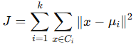

= K-means

K-Means는 비지도 학습에서 가장 널리 사용되는 클러스터링 알고리즘 중 하나로, 데이터를 𝑘개의 그룹(클러스터)으로 나누는 데 사용됩니다. 이 알고리즘은 클러스터의 중심(centroid)을 반복적으로 업데이트하여 데이터를 그룹화합니다.

== 알고리즘 개요

K-Means의 목표는 데이터를 𝑘개의 클러스터로 나누어, 같은 클러스터에 있는 데이터 포인트가 서로 비슷하고, 다른 클러스터의 데이터 포인트와는 다르게 만드는 것입니다. 작동 방식은 아래와 같습니다.

1. 클러스터 개수 𝑘 설정
* 사용자가 클러스터의 수를 미리 정합니다.
2. 초기 중심(centroid) 설정
* 데이터에서 무작위로 𝑘개의 초기 중심을 선택합니다.
3. 클러스터 할당
* 각 데이터 포인트를 가장 가까운 중심에 할당합니다.
* 거리는 보통 유클리디안 거리(Euclidean distance)를 사용합니다.
4. 중심 업데이트
* 각 클러스터의 중심을 클러스터 내 데이터 포인트의 평균으로 업데이트합니다.
5. 수렴 판단
* 중심이 더 이상 변하지 않거나, 클러스터 할당이 더 이상 바뀌지 않으면 종료합니다.
* 최대 반복 횟수에 도달하면 강제로 종료될 수도 있습니다.

== 수학적 정의

K-Means는 아래의 목적 함수를 최소화합니다:

* 𝑘: 클러스터 개수
* 𝐶~𝑖~: 𝑖-번째 클러스터
* 𝜇~𝑖~: 𝑖-번째 클러스터의 중심
* ∥𝑥 − 𝜇~𝑖~∥^2^: 데이터 포인트 𝑥와 중심 𝜇~𝑖~간의 거리

== 장점

1. 간단하고 빠름
* 대규모 데이터에서도 효율적입니다.
* 계산 복잡도는 𝑂(𝑛 ⋅ 𝑘 ⋅ 𝑖)로, 𝑛은 데이터 수, 𝑘는 클러스터 수, 𝑖는 반복 횟수입니다.
2. 해석이 쉬움
* 클러스터 중심이 데이터의 대표 값을 나타냅니다.

== 단점

1. 클러스터 개수 𝑘 지정 필요:
* 사용자 정의가 필요하며, 적절한 𝑘를 선택하는 것이 어렵습니다.
2. 초기화 민감성
* 초기 중심 선택에 따라 결과가 달라질 수 있습니다.
3. 구형 클러스터에 적합
* 데이터가 구형(spherical)이 아니거나 밀도가 일정하지 않으면 성능이 떨어질 수 있습니다.
4. 이상치(outlier) 민감성:
* 이상치가 클러스터 중심에 큰 영향을 미칠 수 있습니다.

== 활용 사례

* 고객 세분화 +
고객 데이터를 그룹화하여 맞춤형 마케팅 전략 수립.
* 이미지 압축 +
유사한 색상을 클러스터로 묶어 색상을 줄임.
* 문서 분류 +
텍스트 데이터를 클러스터링하여 유사한 문서를 그룹화.
* 이상 탐지 +
비정상적인 데이터를 클러스터에서 멀리 떨어진 점으로 감지.

== 예제 코드

[source, python]
----
from sklearn.cluster import KMeans
import numpy as np
import matplotlib.pyplot as plt

# 데이터 생성
np.random.seed(42)
data = np.random.rand(100, 2)  # 100개의 2D 데이터 포인트

# K-Means 모델 학습
k = 3  # 클러스터 개수
kmeans = KMeans(n_clusters=k, random_state=42)
kmeans.fit(data)

# 클러스터 결과
labels = kmeans.labels_  # 각 데이터 포인트의 클러스터 레이블
centroids = kmeans.cluster_centers_  # 클러스터 중심

# 시각화
for i in range(k):
    cluster_points = data[labels == i]
    plt.scatter(cluster_points[:, 0], cluster_points[:, 1], label=f'Cluster {i}')
plt.scatter(centroids[:, 0], centroids[:, 1], c='red', marker='x', label='Centroids')
plt.legend()
plt.title("K-Means Clustering")
plt.show()
----