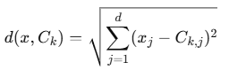

= KMeans 알고리즘 동작 방식

K-Means 알고리즘은 주어진 데이터를 𝑘개의 클러스터로 나누는 비지도 학습(unsupervised learning) 방법입니다. 이 알고리즘은 각 클러스터 중심(Centroid)을 기준으로 데이터를 할당하고 반복적으로 업데이트하여 데이터 포인트 간의 거리(주로 유클리드 거리)를 최소화합니다.

== K-Means 알고리즘의 동작 방식

K-Means 알고리즘은 다음과 같은 단계를 반복합니다:

1. 1단계: 초기화
* 𝑘개의 클러스터 중심(Centroid)을 초기화합니다.
** 랜덤하게 초기화하거나, 데이터를 샘플링하여 선택합니다 (K-Means++ 방식 사용 가능).
2. 2단계: 클러스터 할당
* 각 데이터 포인트를 가장 가까운 클러스터 중심(Centroid)에 할당합니다.
* 거리는 보통 유클리드 거리를 사용하여 계산합니다:
+

 
* ​𝑥는 데이터 포인트,
* 𝐶~𝑘~는 클러스터 𝑘의 중심입니다.
3. 3단계: 클러스터 중심 업데이트
* 각 클러스터의 중심을 업데이트합니다.
* 클러스터에 속한 모든 데이터 포인트의 평균을 계산하여 새로운 Centroid로 설정합니다:
+

* 𝑛~𝑘~는 클러스터 𝑘에 속한 데이터 포인트의 개수

4. 4단계: 반복
* 2단계와 3단계를 반복하여 Centroid가 더 이상 크게 이동하지 않을 때(수렴)까지 실행합니다.

5. 종료 조건
* Centroids가 거의 움직이지 않을 때
* 데이터 포인트의 클러스터 할당이 더 이상 변경되지 않을 때
* 또는 최대 반복 횟수에 도달했을 때

