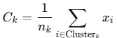

= 중심점(Centroids)

K-Means 알고리즘에서 **Centroids(중심점)**은 각 클러스터의 중심을 나타내는 점으로, 클러스터링 과정에서 매우 중요한 역할을 합니다. 다음은 K-Means 알고리즘에서 Centroids의 개념과 동작 방식에 대한 자세한 설명입니다.

== Centroids
* Centroids는 클러스터의 중심을 나타내는 지점입니다.
* 각 클러스터에 속한 데이터 포인트들의 평균 위치를 계산하여 정합니다.
* K-Means 알고리즘에서는 Centroids를 지속적으로 업데이트하여 클러스터링 품질을 향상시킵니다.

== Centroids 계산 방식

* 각 클러스터의 모든 데이터 포인트의 평균 값을 계산합니다.
* 수학적으로, 클러스터 𝑘에 대한 Centroid 𝐶~𝑘~는 다음과 같이 계산됩니다:
+

+
* 𝐶~𝑘~ : 클러스터 𝑘의 Centroid
* 𝑛~𝑘~ : 클러스터 𝑘에 속한 데이터 포인트의 개수
* 𝑥~𝑖~ : 클러스터 𝑘에 속한 데이터 포인트

== K-Means 알고리즘에서 Centroids의 역할

1. 초기화
* Centroids는 랜덤하게 초기화되거나, 데이터에서 무작위로 선택됩니다.
2. 할당 단계
* 각 데이터 포인트는 가장 가까운 Centroid에 할당됩니다. (보통 유클리디안 거리 사용)
3. 업데이트 단계:
* 각 클러스터의 Centroid를 계산하여 업데이트합니다.
* Centroid는 클러스터 내 데이터 포인트의 평균 위치로 이동합니다.
4. 반복
* 할당과 업데이트 단계를 반복하며 Centroids가 더 이상 크게 이동하지 않을 때(수렴) 알고리즘이 종료됩니다.

== 예제

[source, python]
----
import numpy as np

def compute_centroids(data, labels, k):
    """
    클러스터 중심 (Centroids) 계산 함수.

    Parameters:
    - data: numpy 배열, shape (n_samples, n_features)
    - labels: numpy 배열, shape (n_samples,), 클러스터 할당 라벨
    - k: 클러스터 개수

    Returns:
    - centroids: numpy 배열, shape (k, n_features), 각 클러스터의 중심점
    """
    n_features = data.shape[1]
    centroids = np.zeros((k, n_features))  # 중심점 초기화
    
    for cluster in range(k):
        # 현재 클러스터에 속한 포인트 추출
        cluster_points = data[labels == cluster]
        # 클러스터 중심 계산 (평균)
        if len(cluster_points) > 0:
            centroids[cluster] = np.mean(cluster_points, axis=0)
    
    return centroids

# 예제
data = np.array([[1.0, 2.0], [1.5, 1.8], [5.0, 8.0], [8.0, 8.0]])
labels = np.array([0, 0, 1, 1])  # 클러스터 할당
k = 2  # 클러스터 개수

centroids = compute_centroids(data, labels, k)
print("계산된 Centroids:\n", centroids)
----

위 코드는 다음과 같은 결과를 반환합니다:

Cluster 0: [1.0,2.0],[1.5,1.8]의 평균 → [1.25,1.9]
Cluster 1: [5.0,8.0],[8.0,8.0]의 평균 → [6.5,8.0]

== 특징

* Centroids는 클러스터의 중심을 나타내며, 각 반복(iteration)마다 업데이트됩니다.
* K-Means 알고리즘이 수렴하면 Centroids가 더 이상 이동하지 않습니다.
* 초기 Centroids 선택은 알고리즘의 성능과 결과에 큰 영향을 미칠 수 있습니다.

== 주의사항
* 빈 클러스터 문제 +
어떤 클러스터에 데이터 포인트가 할당되지 않으면, 해당 클러스터의 Centroid가 정의되지 않습니다. 이를 해결하기 위해 재초기화나 다른 전략을 사용할 수 있습니다.
* 초기화 영향 +
Centroids 초기값이 나쁘게 설정되면 최적의 클러스터링 결과를 얻지 못할 수 있습니다. K-Means++ 알고리즘이 이러한 문제를 완화합니다.

Centroids는 K-Means의 핵심으로, 클러스터링 성능을 결정하는 중요한 요소입니다!