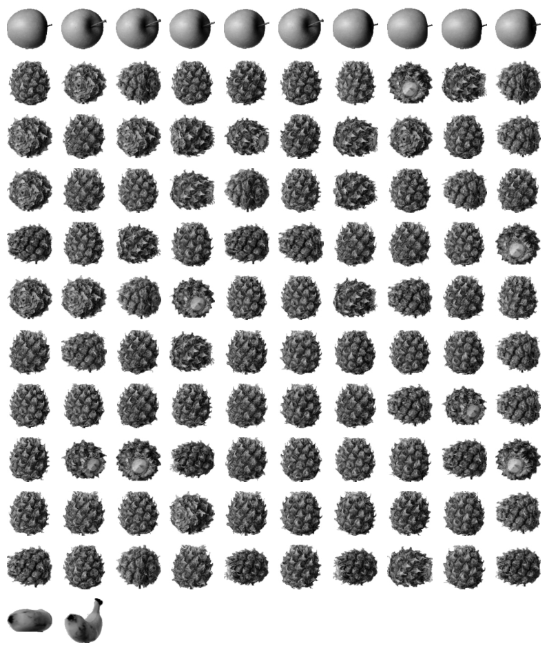
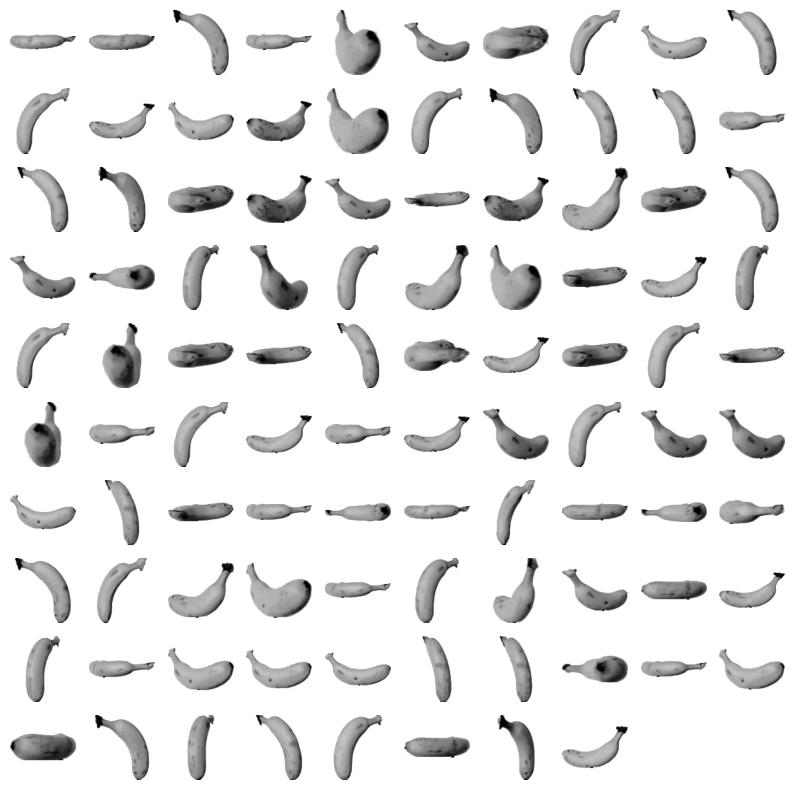
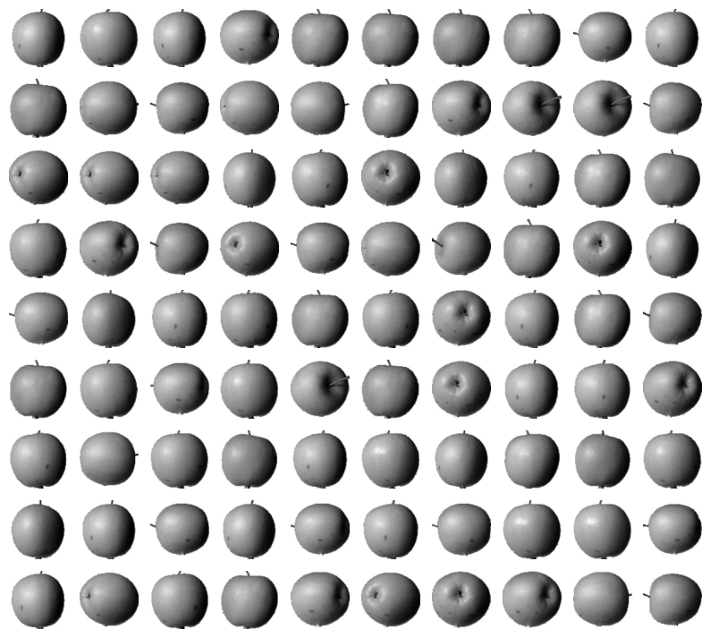
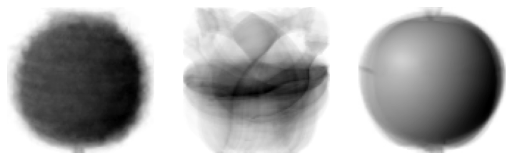

= Lab 8-4 K-means 모델을 사용한 이미지 분류

이 연습에서는 K-menas 모델을 사용하여 이전 연습에서 분류한 이미지를 KMeans 모델을 사용하여 분류합니다. 아래 절차에 따릅니다.

== 실습 환경 준비

여기에서는 Visual Studio Code의 Jupyter Notebook을 사용하여 연습을 수행합니다. 이 연습의 수행 환경은 Lab 1-1에서와 같습니다.

. Visual Studio Code를 실행합니다.
. 파일 메뉴에서 폴더 열기 를 클릭합니다.
. 연습을 수행할 폴더를 선택하고 확인 버튼을 클릭합니다.
. Visual Studio Code의 Explorer 에서 New Button을 클릭하여 새 파일을 만들고, 이름을 lab8-2.ipynb로 지정합니다.
. 오른쪽 위의 Select Kernel 을 클릭하고 Anaconda Python 환경을 선택합니다.
. + Code 버튼을 클릭하여 노트북을 시작합니다.

== 라이브러리 import

이 연습에서는 numpy, matplotlib.pyplot 라이브러리를 사용합니다. 아래 절차에 따라 연습에 필요한 라이브러리를 import 합니다.

1. 생성한 Code 노트에 아래 코드를 입력합니다.
+
[source, python]
----
import numpy as np
import matplotlib.pyplot as plt
----

2. Shift + Enter 를 클릭하여 작성한 코드를 실행합니다.

== 데이터 준비

이 연습에서는 Lab 8-3에서 사용한 데이터를 사용합니다. 아래 절차에 따라 데이터를 준비합니다.

1. 아래와 유사한 코드를 실행하여 데이터를 로드합니다.
+
[source, python]
----
fruits = np.load('fruits_300.npy')
----
+
2. 아래 코드를 사용하여 300 * 100 * 100 배열을 300 * 10000 배열로 변환합니다. 
+
[source, python]
----
fruits_2d = fruits.reshape(-1, 100 * 100)
----
+
3. 아래 코드를 실행하여 fruits_2d 배열의 모양을 확인합니다.
+
[source, python]
----
fruits_2d.shape
----
+
----
(300, 10000)
----

== 모델 생성, 학습, 평가

여기에서는 K-Means 모델을 생성하고 준비된 데이터를 생성하여 학습한 후 생성된 클러스터를 확인합니다. 아래 절차에 따릅니다.

1. 아래 코드를 실행하여 KMeans 모델을 import 합니다.
+
[source, python]
----
from sklearn.cluster import KMeans
----
+
2. 아래 코드를 실행하여 KMeans 모델 객체를 생성합니다.
+
[source, python]
----
km = KMeans(n_clusters=3, random_state=42)
----
+
3. 아래 코드를 실행하여 모델을 학습합니다.
+
[source, python]
----
km.fit(fruits_2d)
----
+
4. 아래 코드를 실행하여 3개 클러스터로 분류된 각 데이터의 레이블을 확인합니다.
+
[source, python]
----
km.labels_
----
+
----
array([2, 2, 2, 2, 2, 0, 2, 2, 2, 2, 2, 2, 2, 2, 2, 2, 2, 2, 0, 2, 2, 2,
       2, 2, 2, 2, 0, 2, 2, 2, 2, 2, 2, 2, 2, 2, 2, 2, 2, 2, 2, 2, 0, 2,
       0, 2, 2, 2, 2, 2, 2, 2, 0, 2, 2, 2, 2, 2, 2, 2, 2, 2, 0, 0, 2, 2,
       2, 2, 2, 2, 2, 2, 0, 2, 2, 2, 2, 2, 2, 2, 2, 2, 2, 2, 2, 2, 2, 2,
       2, 2, 2, 0, 2, 2, 2, 2, 2, 2, 2, 2, 0, 0, 0, 0, 0, 0, 0, 0, 0, 0,
       0, 0, 0, 0, 0, 0, 0, 0, 0, 0, 0, 0, 0, 0, 0, 0, 0, 0, 0, 0, 0, 0,
       0, 0, 0, 0, 0, 0, 0, 0, 0, 0, 0, 0, 0, 0, 0, 0, 0, 0, 0, 0, 0, 0,
       0, 0, 0, 0, 0, 0, 0, 0, 0, 0, 0, 0, 0, 0, 0, 0, 0, 0, 0, 0, 0, 0,
       0, 0, 0, 0, 0, 0, 0, 0, 0, 0, 0, 0, 0, 0, 0, 0, 0, 0, 0, 0, 0, 0,
       0, 0, 1, 1, 1, 1, 1, 1, 1, 1, 1, 1, 1, 1, 1, 1, 1, 1, 1, 1, 1, 1,
       1, 1, 1, 1, 1, 1, 1, 1, 1, 1, 1, 0, 1, 1, 1, 1, 1, 1, 1, 1, 1, 1,
       1, 1, 1, 1, 1, 1, 1, 1, 1, 1, 1, 1, 1, 1, 1, 1, 1, 1, 1, 1, 1, 1,
       1, 1, 1, 1, 1, 1, 1, 1, 1, 0, 1, 1, 1, 1, 1, 1, 1, 1, 1, 1, 1, 1,
       1, 1, 1, 1, 1, 1, 1, 1, 1, 1, 1, 1, 1, 1])
----
+
5. 아래 코드를 실행하여 각 레이블로 분류된 데이터를 확인합니다.
+
[source, python]
----
print(np.unique(km.labels_, return_counts=True))
----

== 분류된 그림 출력

여기에서는 분류된 그림을 출력합니다. 아래 절차에 따릅니다.

1. 이미지를 출력하는 draw_fruits() 함수를 아래와 같이 작성합니다.
+
[source, python]
----
def draw_fruits(arr, ratio=1):
    n = len(arr)
    rows = int(np.ceil(n / 10))
    cols = n if rows < 2 else 10

    fig, axs = plt.subplots(rows, cols, figsize=(cols * ratio, rows * ratio), squeeze=False)

    for i in range(rows):
        for j in range(cols):
            if i * 10 + j < n:
                axs[i, j].imshow(arr[i * 10 + j], cmap='gray_r')
            axs[i, j].axis('off')
    plt.show()
----
+
2. 아래 코드를 실행하여 label이 0으로 분류된 클러스터의 과일을 확인합니다.
+
[source, python]
----
draw_fruits(fruits[km.labels_ == 0])
----
+

+
3. 아래 코드를 실행하여 label이 1로 분로된 클러스터의 과일을 확인합니다.
+
[source, python]
----
draw_fruits(fruits[km.labels_ == 1])
----
+

+
4. 아래 코드를 실행하여 label이 2로 분류된 클러스터의 과일을 확인합니다.
+
[source, python]
----
draw_fruits(fruits[km.labels_ == 2])
----
+

== 클러스터 centroids 확인

KMeans 클래스가 최종적으로 찾은 클러스터의 중심은 cluster_centers_ 속성에 저장되어 있습니다. 여기에서는 클러스터 중심을 확인합니다. 아래 절차에 따릅니다.

1. 아래 코드를 실행하여 클러스터 centroids를 return 받아 모양을 확인합니다.
+
[source, python]
----
centroids = km.cluster_centers_
centroids.shape
----
+
2. 아래 코드를 실행하여 centroids를 2차원 배열로 변환합니다.
+
[source, python]
----
centroids_2d = centroids.reshape(-1, 100, 100)
----
+
3. 아래 코드를 실행하여 centroids로 지정된 데이터를 이미지로 출력합니다.
+
[source, python]
----
draw_fruits(centroids_2d, ratio=3)
----
+

== 데이터와 centroids 거리 확인

KMeans 클래스는 학습 데이터 샘플에서 centroids까지의 거리를 변환해주는 transform() 메소드를 가지고 있습니다. 여기에서는 샘플 데이터와 centroids까지의 거리를 확인하여 분류 결과와 비교합니다. 아래 절차에 따릅니다.

1. 아래 코드를 실행하여 샘플의 50번째 데이터와 centroids와의 거리를 확인합니다. KMeans 객체의 transform() 메소드는 2차원 배열을 필요로 합니다.
+
[source, python]
----
print(km.transform(fruits_2d[50:51]))
----
+
----
[[5376.81995546 8923.65901036 2649.44056082]]
----
+
2. 아래 코드를 실행하여 50번째 데이터의 분류를 확인합니다.
+
[source, python]
----
print(km.predict(fruits_2d[50:51]))
----