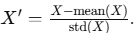
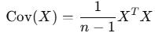

= PCA (주성분 분석)

**PCA(Principal Component Analysis, 주성분 분석)**는 데이터의 차원을 축소하면서 중요한 정보를 최대한 보존하는 데 사용되는 통계적 방법입니다. 이는 데이터의 변동성을 설명하는 주성분(Principal Components)을 찾아 고차원 데이터를 저차원 공간으로 투영하는 방식입니다.

== 목적

* 차원 축소 +
데이터의 특성(변수) 수를 줄여 계산 효율성을 높이고 시각화에 활용.
* 데이터 압축 +
정보 손실을 최소화하며 데이터 크기 감소.
* 노이즈 제거 +
중요한 변동성을 유지하면서 노이즈를 줄임.
* 특성 선택 +
상관관계가 높은 특성을 줄이고 주요 정보를 보존.

== PCA의 주요 개념

1. 주성분(Principal Components)
* 데이터의 분산(변동성)을 가장 잘 설명하는 새로운 축(방향).
* 데이터의 공분산 행렬에서 가장 큰 고유값을 가지는 고유벡터(eigenvector)로 정의됨.
2. 분산(Variance)
* 데이터의 흩어진 정도를 나타냄.
* PCA는 최대 분산을 기준으로 축을 정렬.
3. 직교성(Orthogonality)
* 주성분은 서로 직교(orthogonal)하며 상관관계가 없습니다.

== 동작 원리

1. 데이터 정규화 (Standardization)
* 데이터의 각 특성을 평균 0, 분산 1로 변환.
* 예
+

+
2. 공분산 행렬 계산
* 데이터의 공분산 행렬을 계산:
+

+
3. 고유값 및 고유벡터 계산
* 공분산 행렬의 고유값(eigenvalues)과 고유벡터(eigenvectors)를 계산.
4. 주성분 선택
* 가장 큰 고유값에 해당하는 고유벡터를 주성분으로 선택.
* 필요한 차원 수(𝑘)에 따라 상위 𝑘개의 주성분을 선택.
5. 데이터 변환
* 원본 데이터를 주성분 공간으로 변환:
+
𝑍 = 𝑋𝑊 +
W는 선택된 고유벡터 행렬.

== PCA의 특징

* 선형 변환 기반 방법.
* 각 주성분은 데이터의 변동성을 설명하는 비율(Explained Variance Ratio)을 가짐.
데이터가 선형적으로 분리 가능한 경우 효과적.

== PCA의 장점과 단점
* 장점
** 차원 축소로 계산 효율성 증가.
** 데이터 시각화 가능 (2D 또는 3D로 축소).
** 노이즈 감소 및 데이터 압축 가능.
** 상관관계가 높은 변수들을 제거.
* 단점
** 정보 손실 가능성.
** 비선형 데이터에는 적합하지 않음.
** 해석이 어렵거나 특정 도메인 지식이 필요.

== 예제

[source, python]
----
# 데이터 정규화
from sklearn.preprocessing import StandardScaler

X_std = StandardScaler().fit_transform(X)

# 공분산 행렬 계산
cov_matrix = np.cov(X_std.T)

# 고유값 및 고유벡터 계산
eigenvalues, eigenvectors = np.linalg.eig(cov_matrix)

# 상위 주성분 선택 (2개)
eigenvectors = eigenvectors[:, np.argsort(-eigenvalues)[:2]]

# 데이터 변환
X_pca_manual = X_std @ eigenvectors

# 결과 출력
print("Transformed Data:\n", X_pca_manual)
----

== 응용 분야

. 차원 축소 +
데이터의 시각화와 저장 용량 감소.
. 노이즈 제거 +
중요하지 않은 성분 제거.
. 특성 추출 +
머신러닝 알고리즘의 입력 데이터로 사용.
. 압축 +
데이터의 변동성을 유지하면서 저장 공간 감소.