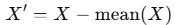
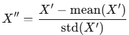
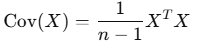
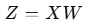
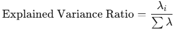

= PCA를 이용한 차원 축소

주성분 분석(PCA, Principal Component Analysis)을 사용하여 차원을 줄이는 과정은 데이터를 고차원 공간에서 변동성을 가장 잘 설명하는 축(주성분)을 따라 저차원 공간으로 투영하는 것을 의미합니다. 이 과정은 데이터의 주요 정보를 최대한 보존하면서 차원을 축소합니다. 아래는 주성분을 이용한 차원 축소 과정을 단계별로 설명한 내용입니다.

1. 데이터 준비 및 정규화 +
PCA를 적용하기 전에 데이터를 준비하고 정규화합니다.
* 평균 중심화:
** 데이터의 각 특성(열)에 대해 평균을 0으로 만듭니다.
** 수식
+

+
* 표준화(Optional):
** 각 특성을 표준 정규 분포(𝜇 = 0, 𝜎 = 1)로 변환합니다.
** 수식:
+

+
 
2. 공분산 행렬 계산

* 데이터의 특성 간 변동성을 나타내는 공분산 행렬을 계산합니다.
* 공분산 행렬은 각 특성 간의 관계(상관성)를 나타냅니다.
* 수식:
+

+
𝑋는 𝑛 × 𝑚 크기의 데이터 행렬(𝑛: 샘플 수, 𝑚: 특성 수)
+
3. 고유값(Eigenvalues) 및 고유벡터(Eigenvectors) 계산
* 공분산 행렬에서 고유값과 고유벡터를 계산합니다.
** 고유값: 각 고유벡터가 설명하는 데이터의 분산 비율.
** 고유벡터: 주성분(Principal Components)의 방향.
* 공분산 행렬 𝐶에 대해:
+
image:../images/image30.png[]
+
𝜆는 고유값, 𝑣는 고유벡터.
+
4. 고유값의 크기에 따라 주성분 선택
* 고유값이 큰 고유벡터일수록 데이터의 변동성을 더 많이 설명합니다.
* 고유값을 내림차순으로 정렬한 후 상위 𝑘개의 고유벡터(주성분)를 선택합니다.
* 이 선택 과정은 데이터를 𝑘-차원으로 축소하는 것을 의미합니다.

5. 원본 데이터를 주성분 공간으로 투영
* 선택된 고유벡터(주성분)로 이루어진 변환 행렬 𝑊를 사용해 데이터를 저차원 공간으로 투영합니다.
* 수식
+

+
** 𝑋: 원본 데이터 (𝑛 × 𝑚)
** 𝑊: 선택된 주성분 행렬 (𝑚 × 𝑘)
** 𝑍: 저차원 데이터 (𝑛 × 𝑘)

6. 데이터 시각화 및 평가
* 저차원 데이터 𝑍를 사용해 결과를 시각화하거나 분석을 수행합니다.
* 설명된 분산 비율(Explained Variance Ratio)을 확인하여 선택된 주성분이 데이터 변동성을 얼마나 설명하는지 평가합니다
+

+
* 𝜆~𝑖~: 각 주성분의 고유값.

== 주성분 축소의 직관적 이해

* 데이터가 𝑚-차원에 있다면, PCA는 가장 분산이 큰 방향부터 새로운 축(주성분)을 생성합니다.
* 이 축에 데이터를 투영(projection)하여 원래 차원에서 중요한 정보만 보존하면서 차원을 축소합니다.
* 예를 들어, 3차원 데이터의 경우 가장 중요한 변동성을 가진 2개의 축(2개의 주성분)을 선택하여 2차원 평면으로 축소할 수 있습니다.

== PCA의 한계

1. 선형성 가정
* PCA는 선형 변환을 기반으로 하므로 비선형적인 데이터 구조를 제대로 표현하지 못할 수 있습니다.
* 비선형 차원 축소 방법으로는 t-SNE, UMAP 등이 사용됩니다.
2. 정보 손실
* 상위 𝑘개의 주성분이 전체 변동성을 충분히 설명하지 못하면 중요한 정보를 잃을 수 있습니다.
3. 해석의 어려움
* 변환된 축(주성분)은 원본 데이터의 의미를 해석하기 어려울 수 있습니다.