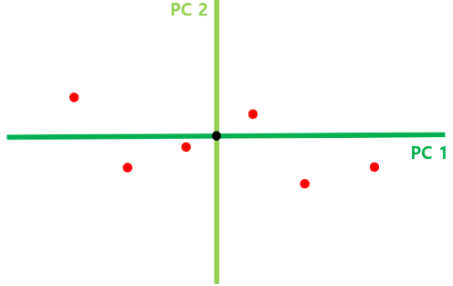

= PCA를 이용한 차원 축소

차원 축소를 위해서는 PCA를 가장 많이 사용합니다. 머신러닝, 데이터마이닝, 통계 분석, 노이즈 제가 등 다양한 분야에서 많이 사용됩니다.

== PCA 알고리즘의 동작

아래와 같은 데이터가 있을 때,

[%header, cols="3"]
|===
||키|몸무게
|사람1|170|68
|사람2|174|72
|사람3|172|84
|사람4|176|76
|사람5|168|60
|사람6|166|74
|===

위 데이터는 아래와 같이 좌표상에서 표시됩니다.

PCA 알고리즘이 차원을 낮추어 축소하는 단계는 아래와 같습니다.

1. 각 축에 대한 평균값을 구한 뒤, 해당 점이 원점이 되도록 Shift 합니다.
+
image:../images/image34.png[]
+
2. 데이터에서 원점을 지나는 직선에 수선의 발을 내려, 해당 길이가 최대가 되는 직선을 찾습니다.
+

+
위 그림처럼 모든 데이터에 대해 원점을 지나는 직선에 수선의 발을 내리면, 원점으로 부터 수선의 발까지의 길이를 구할 수 있습니다. 원점을 구하는 직선의 기울기가 변함에 따라, 빨간색 직선의 길이가 변합니다. 이 선들의 길이 제곱들의 합이 최대가 되는 직선을 구합니다. (이때 빨간 선들의 길이 합을 SS(Sum of Square)라고 합니다)
+
image:../images/image36.png[]
+
3. 찾은 직선을 PC1으로 설정하고, loading score를 구합니다.
+

+
이때 PC1과 방향이 같은 벡터를 "PC1의 Singular vector" 혹은 "PC1의 Eigenvector" 라고 합니다. 또한, PC1의 Singular vector의 x 축 길이와 y 축 길이의 비율을 Loading score 라고 합니다.
+
4. PC1에 직교하는 직선 구하여 PC2로 지정합니다.
+

+
위의 예시의 경우 2차원이므로 PC1에 직교하는 직선이 유일하지만, 만약 3차원의 경우라면, PC1에 직교하는 직선이 평면으로 나오게됩니다. 이 경우에는, PC1에 직교하는 평면 중에서, 2단계의 과정을 다시 거쳐 수선의 발까지의 거리합이 최대가 되는 직선을 선택해주면 된다. N 차원이면 N개의 PC 직선이 구해집니다.
+
5. PC1과 PC2를 축으로 하여 회전시킨 뒤, scree plot 생성합니다.
+

+
구해진 PC1과 PC2 직선을 각각 x, y축이 되도록 데이터를 회전시키면 위 그림과 같이 됩니다.
+
각 PC 축이 전체 데이터를 얼마나 잘 표현하는지 나타낼 수 있습니다. PC1와 SS와 PC2의 SS의 비율을 구하면 어떤 축이 데이터의 분산을 잘 표현하는지 알 수 있습니다. 이 비율을 표현하는 차트를 scree plot이라고 하며, 아래와 같은 형식의 차트가 됩니다.
+

+
위 그래프의 의미는 PC1 축이 전체 데이터 특징의 89%를 나타내고 있으며, PC2 축은 전체 데이터 특징의 11% 정도를 나타내고 있다는 것을 알 수 있습니다. 89%의 특징으로 해당 데이터를 잘 찾아낼 수 있을 것이라고 판단되면 PC2 축을 제거하고 PC1 축 만으로 데이터를 표현할 수 있다고 판단합니다. 이렇게 판단되면 PC2 축을 제거하고 PC1 축으로 1차원으로 나타낼 수 있습니다.
+

////
== 수학적 해석

=== 분산(Variance)

분산(Variance)은 데이터가 평균으로부터 얼마나 흩어져 있는지를 나타내는 통계적 척도입니다. 분산은 편차 제곱합의 평균으로 구할 수 있습니다.

위 데이터에서 분산은 아래촤 같이 구할 수 있습니다.

* 첫 번째 데이터: ((-1 - 0)^2^ + (1 - 0)^2^) / 3 = 0.666
* 두 번째 데이터: ((-3 - 0)^2^ + (3 - 0)^2^) / 3 = 6

=== 공분산(Covariance)

공분산은 고차원에서 데이터들간의 분산을 나타내는 값입니다. 공분산을 구하는 공식은 아래와 같습니다.
+

+

https://ddongwon.tistory.com/114
////

== PCA의 한계

1. 선형성 가정
* PCA는 선형 변환을 기반으로 하므로 비선형적인 데이터 구조를 제대로 표현하지 못할 수 있습니다.
* 비선형 차원 축소 방법으로는 t-SNE, UMAP 등이 사용됩니다.
2. 정보 손실
* 상위 𝑘개의 주성분이 전체 변동성을 충분히 설명하지 못하면 중요한 정보를 잃을 수 있습니다.
3. 해석의 어려움
* 변환된 축(주성분)은 원본 데이터의 의미를 해석하기 어려울 수 있습니다.