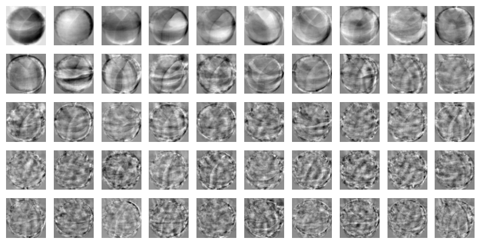
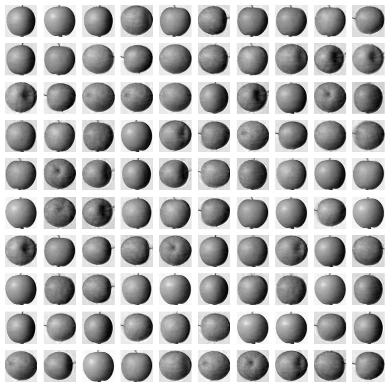
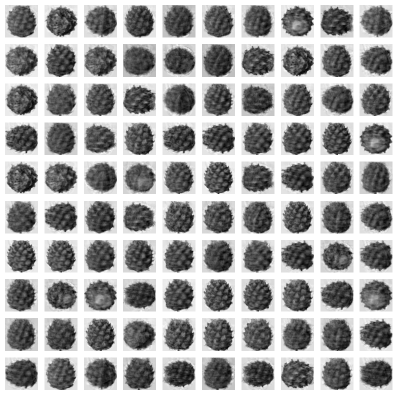
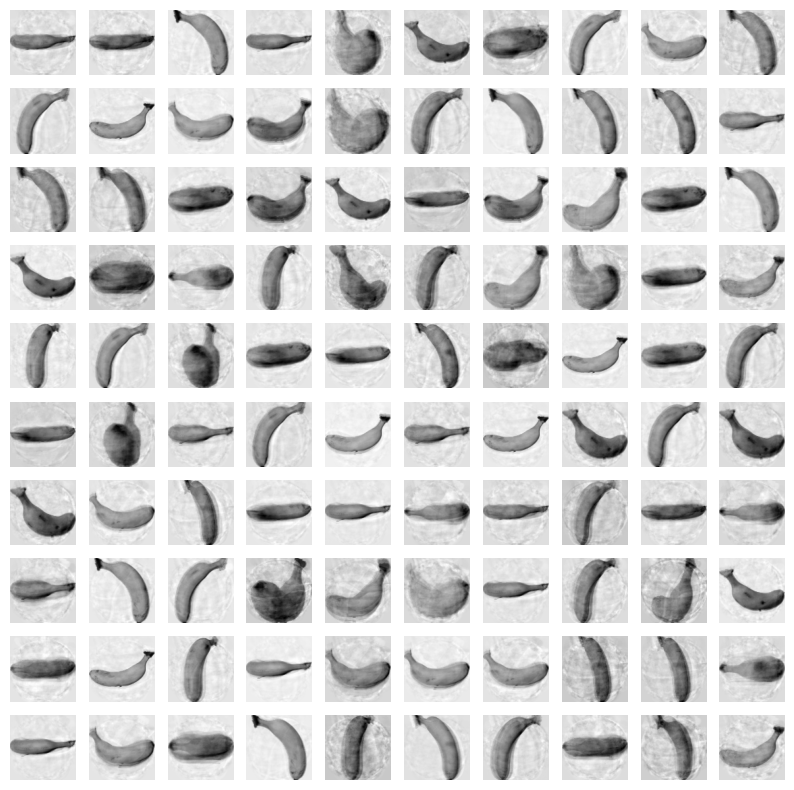

= Lab 8-5 PCA를 이용한 차원 축소

이 연습에서는 Lab 8-4에서 사용했던 데이터에 대해 PCA 차원 축소를 적용한 후 분석을 수행합니다. 아래 절차에 따릅니다.

== 실습 환경 준비

여기에서는 Visual Studio Code의 Jupyter Notebook을 사용하여 연습을 수행합니다. 이 연습의 수행 환경은 Lab 1-1에서와 같습니다.

. Visual Studio Code를 실행합니다.
. 파일 메뉴에서 폴더 열기 를 클릭합니다.
. 연습을 수행할 폴더를 선택하고 확인 버튼을 클릭합니다.
. Visual Studio Code의 Explorer 에서 New Button을 클릭하여 새 파일을 만들고, 이름을 lab8-2.ipynb로 지정합니다.
. 오른쪽 위의 Select Kernel 을 클릭하고 Anaconda Python 환경을 선택합니다.
. + Code 버튼을 클릭하여 노트북을 시작합니다.

== 라이브러리 import

이 연습에서는 numpy, matplotlib.pyplot 라이브러리를 사용합니다. 아래 절차에 따라 연습에 필요한 라이브러리를 import 합니다.

1. 생성한 Code 노트에 아래 코드를 입력합니다.
+
[source, python]
----
import numpy as np
import matplotlib.pyplot as plt
----

2. Shift + Enter 를 클릭하여 작성한 코드를 실행합니다.

== 데이터 준비

이 연습에서는 Lab 8-3에서 사용한 데이터를 사용합니다. 아래 절차에 따라 데이터를 준비합니다.

1. 아래와 유사한 코드를 실행하여 데이터를 로드합니다.
+
[source, python]
----
fruits = np.load('fruits_300.npy')
----
+
2. 아래 코드를 사용하여 300 * 100 * 100 배열을 300 * 10000 배열로 변환합니다. 
+
[source, python]
----
fruits_2d = fruits.reshape(-1, 100 * 100)
----
+
3. 아래 코드를 실행하여 fruits_2d 배열의 모양을 확인합니다.
+
[source, python]
----
fruits_2d.shape
----
+
----
(300, 10000)
----

== PCA를 이용한 차원 축소

여기에서는 PCA를 이용하여 차원을 축호합니다. 아래 절차에 따릅니다.

1. 아래 코드를 실행하여 PCA 모델을 import 합니다.
+
[source, python]
----
from sklearn.decomposition import PCA
----
+
2. 아래 코드를 실행하여 주 성분의 개수를 50개로 지정하여 모델을 생성합니다.
+
[source, python]
----
pca = PCA(n_components=50)
----
+
3. 아래 코드를 실행하여 학습합니다.
+
[source, python]
----
pca.fit(fruits_2d)
----
+
4. 차원이 축소된 데이터를 확인합니다.
+
[source, python]
----
print(pca.components_.shape)
----
+
----
(50, 10000)
----

== 차원 축소된 데이터 출력

여기에서는 차원 축소된 데이터를 사용하여 이미지를 출력합니다. 아래 절차에 따릅니다.

1. 아래 코드를 실행하여 그림을 출력하는 draw_fruits() 함수를 작성합니다.
+
[source, python]
----
def draw_fruits(arr, ratio=1):
    n = len(arr)
    rows = int(np.ceil(n / 10))
    cols = n if rows < 2 else 10

    fig, axs = plt.subplots(rows, cols, figsize=(cols * ratio, rows * ratio), squeeze=False)

    for i in range(rows):
        for j in range(cols):
            if i * 10 + j < n:
                axs[i, j].imshow(arr[i * 10 + j], cmap='gray_r')
            axs[i, j].axis('off')
    plt.show()
----
+
2. 아래 코드를 실행하여 데이터를 이미지 형식으로 출력합니다.
+
[source, python]
----
draw_fruits(pca.components_.reshape(-1, 100, 100))
----
+

== 원본 데이터 차원 축소

여기에서는 학습된 PCA 모델을 사용하여 원본 데이터의 차원을 축소합니다. 아래 절차에 따릅니다.

1. 아래 코드를 실행하여 원본데이터의 차원을 축소합니다.
+
[source, python]
----
fruits_pca = pca.transform(fruits_2d)
----
+
2. 아래 코드를 실행하여 차원이 축소된 데이터를 확인합니다.
+
[source, python]
----
print(fruits_pca.shape)
----
+
----
(300, 50)
----

== 차원 축소된 데이터 복원

차원 축소된 데이터를 복원할 수 있습니다. 손실이 발생하지만, 분산이 큰 방향으로 데이터를 투영하였으므로 원본 데이터를 손실을 감안하여 재구성할 수 있습니다. 아래 절차에 따릅니다.

1. 아래 코드를 실행하여 차원을 복원합니다.
+
[source, python]
----
fruits_inverse = pca.inverse_transform(fruits_pca)
----
+
2. 아래 코드를 실행하여 복원된 데이터를 확인합니다.
+
[source, python]
----
print(fruits_inverse.shape)
----
+
----
(300, 10000)
----
+
3. 아래 코드를 실행하여 복원된 데이터를 2차원 배열로 변환합니다.
+
[source, python]
----
fruits_recon = fruits_inverse.reshape(-1, 100, 100)
----
+
4. 아래 코드를 실행하여 복원된 데이터를 이미지 형식으로 출력합니다.
+
[source, python]
----
for start in [0, 100, 200]:
    draw_fruits(fruits_recon[start:start + 100])
    print('\n')
----
+

+

+
