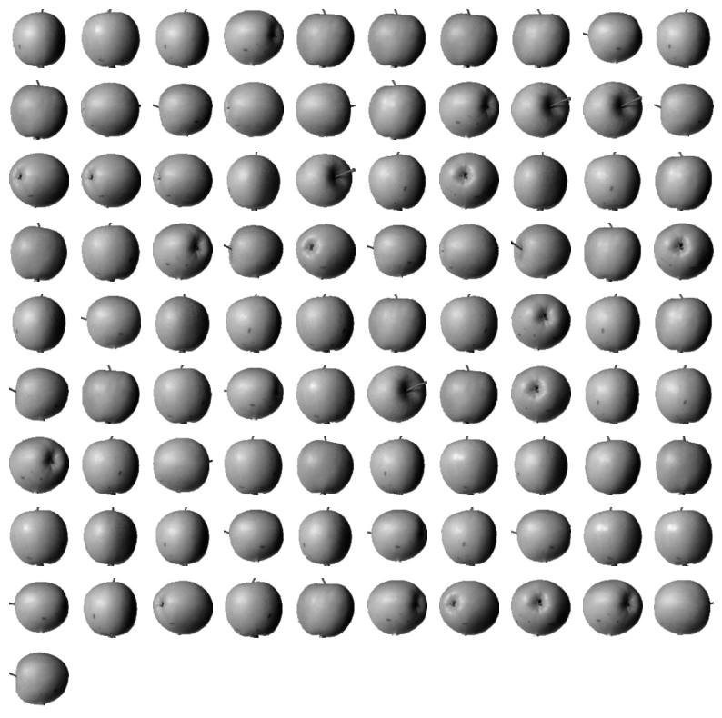

= Lab 8-6 주 성분 분석을 통한 차원 축소

이 연습에서는 PCA를 사용하여 차원을 축소한 후 여러 LogisticRegression 모델과 KMeans 사용하여 회귀와 분류를 수행합니다. 아래 절차에 따릅니다.

== 실습 환경 준비

여기에서는 Visual Studio Code의 Jupyter Notebook을 사용하여 연습을 수행합니다. 이 연습의 수행 환경은 Lab 1-1에서와 같습니다.

. Visual Studio Code를 실행합니다.
. 파일 메뉴에서 폴더 열기 를 클릭합니다.
. 연습을 수행할 폴더를 선택하고 확인 버튼을 클릭합니다.
. Visual Studio Code의 Explorer 에서 New Button을 클릭하여 새 파일을 만들고, 이름을 lab8-2.ipynb로 지정합니다.
. 오른쪽 위의 Select Kernel 을 클릭하고 Anaconda Python 환경을 선택합니다.
. + Code 버튼을 클릭하여 노트북을 시작합니다.

== 라이브러리 import

이 연습에서는 Numpy, matplotlib, Sckit Learn 라이브러리를 사용합니다. 아래 절차에 따라 연습에 필요한 라이브러리를 import 합니다.

1. 생성한 Code 노트에 아래 코드를 입력합니다.
+
[source, python]
----
import numpy as np
import matplotlib.pyplot as plt
from sklearn.linear_model import LogisticRegression
----
+
2. Shift + Enter를 클릭하여 작성한 코드를 실행합니다.

== 데이터 준비

이 연습에서는 Lab 8-3에서 사용한 데이터를 사용합니다. 또, 지도학습 모델인 LogisticRegression 모델을 사용하기 위한 target 데이터를 준비합니다. 아래 절차에 따릅니다.

1. 아래와 유사한 코들ㄹ 실행하여 과일 이미지 데이터를 로드합니다.
+
[source, python]
----
fruits = np.load('fruits_300.npy')
----
+
2. 아래 코드를 사용하여 300 * 100 * 100 배열을 300 * 10000 배열로 변환합니다. 
+
[source, python]
----
fruits_2d = fruits.reshape(-1, 100 * 100)
----
+
3. 아래 코드를 사용하여 target 데이터를 생성합니다.
+
[source, python]
----
target = np.array([0] * 100 + [1] * 100 + [2] * 100)
----

== 로지스틱 회귀를 사용한 차원 축소 모델 검증증

여기에서는 로지스틱 회귀 모델을 생성하고 모델의 성능을 평가합니다. 아래 절차에 따릅니다.

1. 아래 코드를 생성하여 로지스틱 회귀 모델을 생성합니다.
+
[source, python]
----
lr = LogisticRegression()
----
+
2. 교차 검증을 위해 cross_validate 함수를 import 합니다.
+
[source, python]
----
from sklearn.model_selection import cross_validate
----
+
3. 아래 코드를 실행하여 교차 검증을 실행하고 결과를 확인합니다.
+
[source, python]
----
scores = cross_validate(lr, fruits_2d, target)
print(np.mean(scores['test_score']))
print(np.mean(scores['fit_time']))
----
+
----
0.9966666666666667
0.16553654670715331
----

== PCA를 이용한 차원 축소

여기에서는 PCA를 사용하여 차원을 축소합니다. 아래 절차에 따릅니다.

1. 아래 코드를 실행하여 PCA 모델을 import 합니다.
+
[source, python]
----
from sklearn.decomposition import PCA
----
+
2. 아래 코드를 실행하여 PCA 모델을 생성하고 과일 데이터의 차원을 축소합니다. 주 성분으로 50개를 사용합니다.
+
[source, python]
----
pca = PCA(n_components=50)
pca.fit(fruits_2d)
fruits_pca = pca.transform(fruits_2d)
----
+
3. 차원이 축소된 데이터를 사용하여 로지스틱 회귀 모델을 검증합니다.
+
[source, python]
----
scores = cross_validate(lr, fruits_pca, target)
print(np.mean(scores['test_score']))
print(np.mean(scores['fit_time']))
----
+
----
0.9966666666666667
0.011842918395996094
----
+
4. 아래 코드를 실행하여 주 성분 비율을 0.5로 지정하고 PCA 모델을 생성하고 학습합니다. 이 경우, PCA는 분산의 50%에 달하는 주 성분을 찾습니다.
+
[source, python]
----
pca = PCA(n_components=0.5)
pca.fit(fruits_2d)
----
+
5. 아래 코드를 실행하여 모델의 주 성분 개수를 확인합니다.
+
[source, python]
----
print(pca.n_components_)
----
+
6. 아래 코드를 실행하여 데이터를 주 성분을 사용하여 차원 축소합니다.
+
[source, python]
----
fruits_pca = pca.transform(fruits_2d)
print(fruits_pca.shape)
----
+
7. 아래 코드를 실행하여 교차 검증을 수행합니다.
+
[source, python]
----
scores = cross_validate(lr, fruits_pca, target)
print(np.mean(scores['test_score']))
print(np.mean(scores['fit_time']))
----
+
----
0.99
0.02562880516052246
----

== KMeans를 사용한 차원 축소 검증

여기에서는 차원 축소된 데이터를 사용하여 KMeans 모델을 사용하여 분류를 수행합니다. 아래 절차에 따릅니다.

1. 아래 코드를 실행하여 KMeans 모델을 생성하고 차원 축소된 데이터를 사용하여 학습합니다.
+
[source, python]
----
from sklearn.cluster import KMeans

km = KMeans(n_clusters=3, random_state=42)
km.fit(fruits_pca)
----
+
2. 아래 코드를 실행하여 분류 결과를 확인합니다.
+
[source, python]
----
print(np.unique(km.labels_, return_counts=True))
----
+
3. 아래 코드를 실행하여 그림을 출력하는 draw_fruits() 함수를 작성합니다.
+
[source, python]
----
def draw_fruits(arr, ratio=1):
    n = len(arr)
    rows = int(np.ceil(n / 10))
    cols = n if rows < 2 else 10

    fig, axs = plt.subplots(rows, cols, figsize=(cols * ratio, rows * ratio), squeeze=False)

    for i in range(rows):
        for j in range(cols):
            if i * 10 + j < n:
                axs[i, j].imshow(arr[i * 10 + j], cmap='gray_r')
            axs[i, j].axis('off')
    plt.show()
----
+
4. 아래 코드를 실행하여 분류 결과를 확인합니다.
+
[source, python]
----
for label in range(0, 3):
    draw_fruits(fruits[km.labels_ == label])
    print("\n")
----
+

+

+

