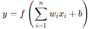
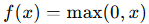
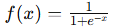
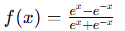

= 신경망 개요

신경망(Neural Network)은 딥러닝의 핵심 구성 요소로, 인간의 뇌에서 영감을 받아 설계된 수학적 모델입니다. 데이터를 학습하고 패턴을 인식하며 복잡한 문제를 해결하는 데 사용됩니다. 

==  개념

신경망은 뉴런(neuron)이라고 불리는 작은 계산 단위들이 연결되어 이루어진 구조입니다. 이 모델은 입력 데이터를 처리하여 원하는 출력을 생성하는데, 입력과 출력 사이의 관계를 학습합니다.

== 신경망의 구성 요소

=== 뉴런 (Neuron)

* 뉴런은 신경망의 기본 단위로, 입력 신호를 받아 가중치와 곱한 후 활성화 함수를 통해 출력 신호를 생성합니다.
* 수학적 표현
+

+
* 𝑥~𝑖~: 입력 값
* 𝑤~𝑖~: 가중치(weight)
* 𝑏: 편향(bias)
* 𝑓: 활성화 함수(Activation Function)

=== 레이어 (Layer)

* 신경망은 여러 층(layer)으로 구성됩니다.
** 입력층(Input Layer): 데이터를 입력받는 층.
** 은닉층(Hidden Layer): 입력 데이터를 처리하고 중간 표현을 생성.
** 출력층(Output Layer): 최종 결과를 출력.

=== 가중치와 편향

* 가중치(weight): 각 입력 신호의 중요도를 조정.
* 편향(bias): 출력값을 조정하기 위해 추가된 상수.

=== 활성화 함수 (Activation Function)

* 입력값의 합계를 비선형적으로 변환하여 복잡한 문제를 해결 가능하게 만듦.
* 대표적인 활성화 함수:
** ReLU
+

+
** Sigmoid: 
+

+
* Tanh: 
+

+
 
=== 신경망의 작동 원리
1 순전파 (Forward Propagation)
* 데이터를 입력하여 각 레이어를 통해 전달하면서 결과를 계산.
* 입력 데이터가 뉴런과 레이어를 거치며 출력값으로 변환.
2 역전파 (Backward Propagation)
* 출력값과 실제 값 사이의 오차를 계산하고, 이를 통해 가중치와 편향을 업데이트.
* 오차 역전파 알고리즘(Backpropagation)을 사용하며, 경사 하강법(Gradient Descent)을 통해 학습.

== 신경망의 종류

1. 기본 신경망 (Feedforward Neural Network, FNN)
* 데이터가 한 방향으로만 전달되는 구조.
* 입력 -> 은닉층 -> 출력의 형태로 구성.
2. 컨볼루션 신경망 (Convolutional Neural Network, CNN)
* 주로 이미지 데이터를 처리하는 데 사용.
* 컨볼루션 레이어를 통해 공간적 패턴을 학습.
3. 순환 신경망 (Recurrent Neural Network, RNN)
* 시계열 데이터나 연속적인 데이터 처리를 위한 구조.
* 데이터 흐름이 순환 구조를 가지며, 시간 의존성을 반영.
4. 생성적 적대 신경망 (Generative Adversarial Network, GAN)
* 두 개의 신경망(생성기와 판별기)이 경쟁적으로 학습하여 새로운 데이터를 생성.
5. 트랜스포머 (Transformer)
* 자연어 처리(NLP)와 시퀀스 데이터 처리에 최적화된 구조.
* 병렬 처리와 주의 메커니즘(Attention)을 활용.

== 신경망 학습 방법

1 손실 함수 (Loss Function)
* 모델의 출력과 실제 값 사이의 오차를 측정.
* 대표적인 손실 함수:
** MSE (Mean Squared Error): 회귀 문제에서 사용.
** Cross-Entropy: 분류 문제에서 사용.
2 경사 하강법 (Gradient Descent)
* 손실 함수를 최소화하기 위해 가중치와 편향을 업데이트.
* 변형된 방법:
** SGD (Stochastic Gradient Descent): 일부 데이터만 사용하여 빠르게 학습.
** Adam: 적응형 학습률을 사용하는 방법.

== 신경망의 장점과 한계

장점

* 비선형적이고 복잡한 패턴 학습 가능.
* 다양한 데이터 유형(이미지, 텍스트, 음성)을 처리 가능.
* 자동 특징 추출로 데이터 전처리 부담 감소.

한계

* 데이터 양과 계산 자원이 많이 필요.
* 과적합(Overfitting) 문제 발생 가능.
* 설명 가능성(Explainability)이 부족.

== 응용 분야

신경망은 컴퓨터 비전, 자연어 처리, 음성 인식, 의료, 금융, 자율주행 등 다양한 분야에서 활용됩니다. 각각의 응용에서 데이터와 목적에 따라 신경망 구조를 선택하고 학습합니다.

신경망은 데이터를 입력받아 학습하고 패턴을 인식하는 강력한 알고리즘입니다. 다양한 구조와 학습 방법으로 복잡한 문제를 해결하며, 인공지능 기술의 중심에 서 있습니다.